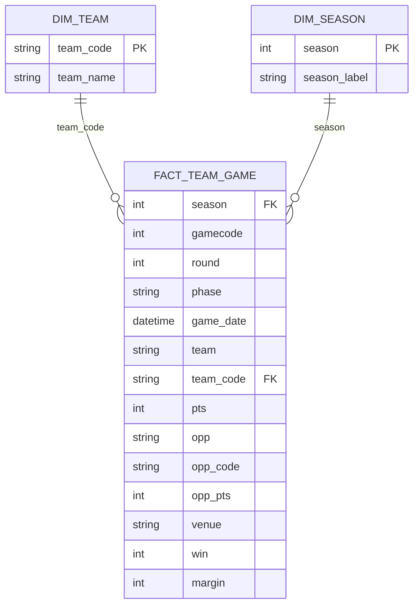

# Euroleague Team Performance Analytics

A data pipeline and analytics project examining EuroLeague basketball team
performance — efficiency, home/away splits, and multi-season trends — built on
game data pulled from the official EuroLeague API.

**Stack:** Python (ETL) → PostgreSQL (star schema) → SQL analysis → Power BI

---

## Overview

This project ingests five seasons of EuroLeague game data, reshapes it into a
clean star schema, and models it for analysis. It's built to answer questions
like: *Which teams are over/underperforming relative to their season average?
How big is home-court advantage, and does it vary by team? What does a team's
rolling form look like across a season?*

**Status:** the ingestion pipeline and data model are built and loaded. SQL
analysis and the Power BI dashboard are the next phase (see [Roadmap](#roadmap)).

## Data

Source: official EuroLeague API, pulled via the [`euroleague-api`](https://pypi.org/project/euroleague-api/) Python package, seasons 2020-21 through 2024-25.

| Metric | Value |
|---|---|
| Seasons | 5 (2020-21 → 2024-25) |
| Unique games | 1,616 |
| Fact table rows | 3,232 (one row per team per game — each game produces 2 rows) |
| Teams | 23 distinct clubs |

### Schema

Star schema, one fact table + two dimensions:



`fact_team_game` grain: **one row per team per game.** A single game yields
exactly two rows (home + away), which is what turns a wide "game report" API
response into a tidy, joinable fact table — and what makes every team-level
aggregation (win %, avg margin, home/away splits) a simple `GROUP BY`.

`win` and `margin` are derived once during ETL rather than recomputed in every
downstream query.

## Pipeline

1. **Pull** — `ingest.py` calls the EuroLeague API for each season, pulling
   seasons concurrently rather than one at a time, then concatenates the raw
   game reports. This cut wall-clock pull time from ~9 min to ~3 min across
   the 5 seasons.
2. **Reshape** — each wide game-report row (home team + away team side by
   side) is split into two long-format rows, one per team, with `win` and
   `margin` computed. Unplayed/future games are dropped.
3. **Build dimensions** — `dim_team` and `dim_season` are derived from the
   fact rows (distinct team codes/names, distinct seasons with a readable
   `"2023-24"` label).
4. **Load** — all three tables are written to CSV and loaded into PostgreSQL.
5. **Constrain** — `schema.sql` adds primary keys, foreign keys, and indexes
   on top of the loaded tables to turn them into an enforced star schema.

Run it:
```bash
pip install euroleague-api pandas sqlalchemy psycopg2-binary
python ingest.py               # pulls all 5 seasons, writes CSVs, loads Postgres
python ingest.py --csv-only    # skip the Postgres load, just produce CSVs
psql -d euroleague -f schema.sql
```

## Known limitations

- **`dim_team` has a handful of duplicate `team_code` values with different
  name strings** (e.g. `BAS` appears as both "Baskonia Vitoria-Gasteiz" and a
  sponsor-prefixed variant from a different season). This is a real data
  quality issue from clubs changing sponsor names across seasons, and it means
  `schema.sql`'s `PRIMARY KEY (team_code)` constraint will currently fail
  until the duplicates are reconciled (e.g. picking the latest name per code).
  Documenting rather than silently dropping rows, since the fix belongs in the
  ETL step, not the schema.

## Roadmap

- **SQL analysis** — win % by team/season, home vs. away splits, rolling
  5-game form and cumulative wins via window functions (`RANK`, `AVG() OVER`,
  `LAG`), and CTE-based questions like largest home/away gap and "clutch"
  performance in close games.
- **Power BI dashboard** — DAX measures (win %, avg margin, home/away edge)
  surfaced through team/season slicers, rolling-form line charts, and a
  team × season win % matrix.
- **Insight write-up** — a handful of finding → why-it-matters statements
  connecting the dashboard back to a business/analyst question.

---

*Educational/portfolio project — not affiliated with EuroLeague Basketball.*
