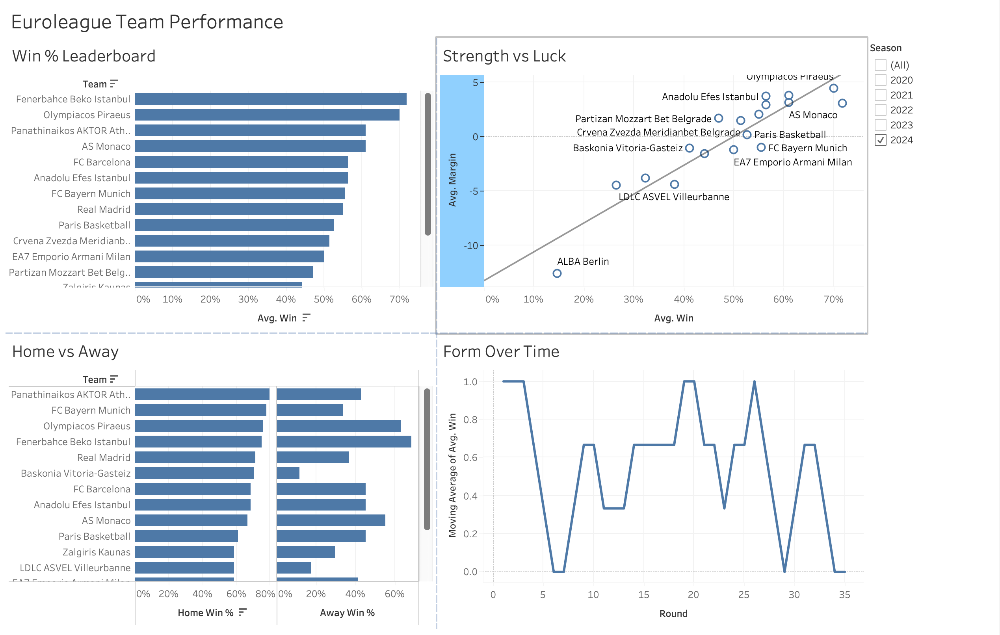
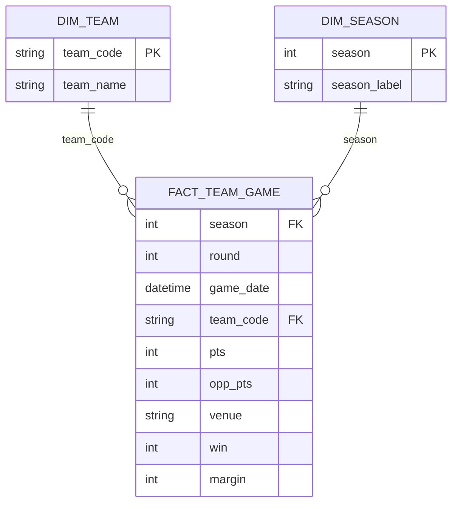

# EuroLeague Team Performance Analytics

An end-to-end analytics project examining EuroLeague basketball team performance
— efficiency, home/away splits, form trends, and the gap between record and
underlying strength — built on five seasons of game data pulled from the
official EuroLeague API.

**Stack:** Python (ETL) → PostgreSQL (star schema) → SQL analysis (window
functions, CTEs) → Tableau (interactive dashboard)



---

## Overview

Five seasons of EuroLeague game data, ingested from a live API, modeled as a
star schema, analyzed with SQL, and surfaced through an interactive Tableau
dashboard. The guiding question: **which teams are genuinely strong versus
merely lucky, and what drives the difference?**

## Data

Source: official EuroLeague API via the
[`euroleague-api`](https://pypi.org/project/euroleague-api/) Python package,
seasons 2020-21 through 2024-25.

| | |
|---|---|
| Seasons | 5 (2020-21 → 2024-25) |
| Games | 1,616 |
| Fact rows | 3,232 (one per team per game — each game = 2 rows) |

### Schema

Star schema — one fact table, two dimensions:



**Grain: one row per team per game.** Each game produces exactly two rows (home
+ away), which turns a wide "game report" API response into a tidy fact table
where every team-level metric — win %, avg margin, home/away splits — is a
simple `GROUP BY`. `win` (1/0) and `margin` are derived once in the ETL so
downstream queries stay clean.

## Pipeline

`ingest.py` pulls each season from the API, reshapes each wide game report into
two team rows (computing `win` and `margin`), builds the two dimension tables,
writes CSVs, and loads PostgreSQL. `schema.sql` then adds primary keys, foreign
keys, and indexes to enforce the star schema.

```bash
pip install euroleague-api pandas sqlalchemy psycopg2-binary
python ingest.py                 # pull 5 seasons, write CSVs, load Postgres
psql -d euroleague -f schema.sql # add keys + indexes
```

## SQL analysis

Ten analysis queries in [`sql/`](sql/), progressing from aggregation to window
functions to CTEs:

1. **Win % by team and season** — `AVG(win)` over the 1/0 flag.
2. **Avg points scored & allowed** — aggregation joined to `dim_team` for names.
3. **Home vs. away splits** — conditional aggregation with `FILTER (WHERE ...)`.
4. **Season rankings** — `RANK() OVER (PARTITION BY season ORDER BY win% DESC)`.
5. **Rolling 5-game form** — `AVG(win) OVER (... ROWS BETWEEN 4 PRECEDING AND CURRENT ROW)`.
6. **Running wins & losses** — `SUM() OVER (...)` cumulative through the season.
7. **Margin swings & cumulative point differential** — `LAG(margin) OVER (...)` plus a running `SUM`.
8. **Season vs. a team's own multi-season baseline** — window `AVG` as a baseline, signed diff.
9. **Largest home-court edge** — CTE ranking teams by home-minus-away win %.
10. **Clutch performance** — win % in games decided by ≤5 points (`ABS(margin) <= 5`), filtered aggregation.

## Dashboard

1. **Win % Leaderboard** — team win rate, sortable.
2. **Home vs. Away** — home and away win % side by side per team.
3. **Form Over Time** — rolling win % across a season, showing hot/cold streaks.
4. **Strength vs. Luck** — win % vs. average point differential, with a trend
   line separating genuinely dominant teams from those living on close games.

## Selected findings

- **Record can overstate a team.** Paris Basketball posted roughly a 53% win rate
  on a near-zero average point differential — winning a disproportionate share
  of close games. Their differential suggests a more average team than the
  record implies, the kind of signal that flags regression risk.
- **Home-court advantage is near-universal.** Home win % exceeded away win % for
  nearly every team-season in the data; Olympiacos in 2020 was the lone exception.
- **Dominance ≠ just winning.** Teams above the trend line (e.g. Olympiacos) won
  *by more* than their record alone predicts — a sign of real strength, not luck.

## Data quality note

EuroLeague clubs are renamed by their sponsor between seasons (e.g. Baskonia →
"Bitci Baskonia" → "Cazoo Baskonia"), so the same club appears under several
`team_name` strings. Grouping on the display name would split one club across
multiple rows and corrupt every aggregate. **All analysis groups on the stable
`team_code`** and selects a representative name with `MAX(team)` — catching and
handling this was one of the more important steps in getting the numbers right.

---

*Educational / portfolio project — not affiliated with EuroLeague Basketball.*
